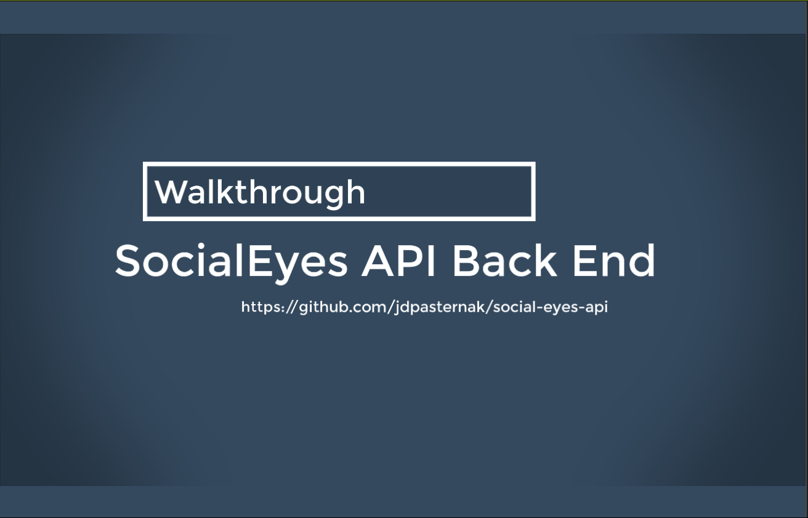

# Social Eyes API

## Description

A back end API server for a social media application.

## Table of Contents

- [Installation](#installation)
- [Usage](#usage)

## Installation

1. Download or clone the code from this repository to an empty directory.
2. Open a terminal window in the directory and run `npm install`.
3. In another terminal window, run `mongod` to start the MongoDB database.
4. Back in the first terminal window, run `npm start`, or `nodemon` if installed. The server should now be running, and a message that says `Listening on http://localhost:3001` will be displayed in the terminal.

## Usage

Since this is a back end API server, its usage revolves around sending API requests to various endpoints using an API client like [Insomnia](https://insomnia.rest/).

Watch the walkthrough video below for an interactive guide, or refer to the [API documentation](#api-documentation).

### Walkthrough

### API Documentation

#### `/api/users`

**GET `/api/users`**
Returns a list of all users.

**GET `/api/users/<userId>`**
Returns a single user based on `userId`.

**POST `/api/users`**
Creates a new user. Expects `username` and `email`.

**PUT `/api/users/<userId>`**
Updates a user. Expects `username` or `email`.

**DELETE `/api/users/<userId>`**
Deletes a user based on `userId`.

**POST `/api/users/<userId>/friends/<friendId>`**
Adds a friend to a user's friends list.

**DELETE `/api/users/<userId>/friends/<friendId>`**
Removes a user from a user's friends list.

#### `/api/thoughts`

**GET `/api/thoughts`**
Returns a list of all thoughts.

**GET `/api/thoughts/<thoughtId>`**
Returns a single thought based on `thoughtId`.

**POST `/api/thoughts`**
Creates a new thought. Expects `thoughtText`, `username`, `userId`.

**PUT `/api/thoughts/<thoughtId>`**
Updates a thought. Expects `thoughtText` or `username`.

**DELETE `/api/thoughts/<thoughtId>`**
Deletes a thought based on `thoughtId`.

**POST `/api/thoughts/<thoughtId>/reactions`**
Adds a reaction to a thought's reactions list. Expects `reactionBody` and `username`.

**DELETE `/api/thoughts/<thoughtId>/reactions`**
Removes a reaction from a reaction's friends list. Expects `reactionId`.
